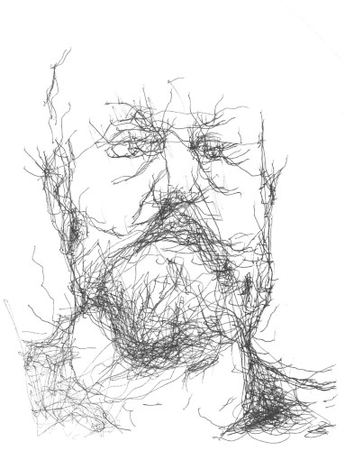

# About Me

I have dedicated my entire educational and professional life to writing. Whether writing code, technical documentation, marketing copy, or a novel, I am always looking for the best way to communicate an idea. Because communication is multi-directional, I am also very much invested in writing as a process, and an important part of that process is review and collaboration.

---

In the autumn of 2023, I finished a front-end web development boot camp offered by [neue fische](https://www.neuefische.de/bootcamp/web-development). Here is a [link](https://github.com/shrocket/hotel-tishjama#readme) to the `README` for my capstone project. You can also find a [link](https://hotel-tishjama-seven.vercel.app/) to a deployment of that app on the same page.

---

For more information about me, please see my (current) [personal website](https://shawnhuelle.com), or have a look at my [LinkedIn Profile](https://www.linkedin.com/in/shawn-huelle-616560237/).

---

This is what I look like to a robot:

